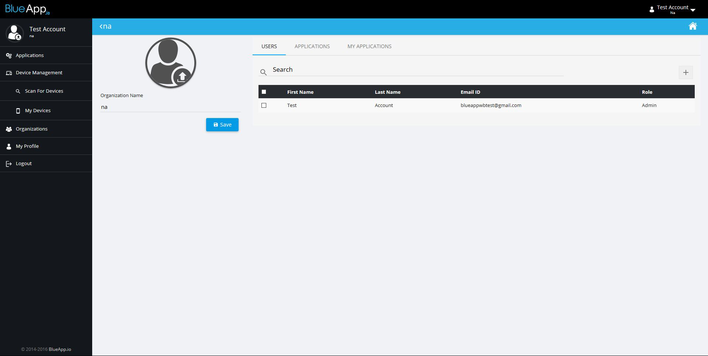
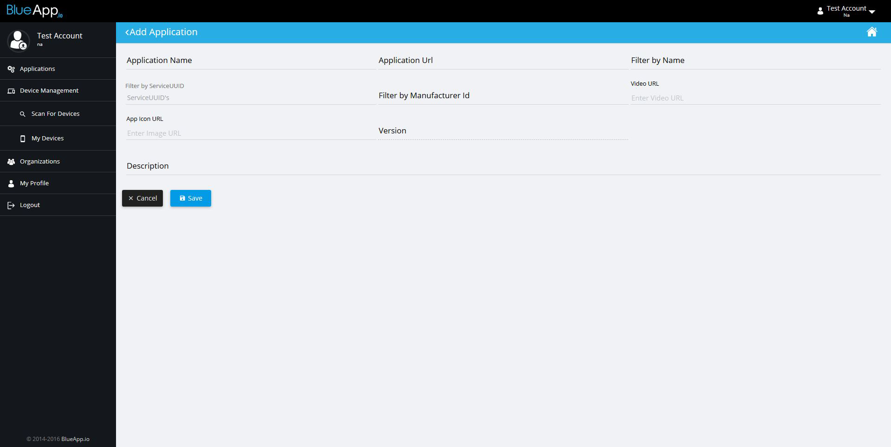

## Adding application to Blueapp

When we get our application ready we can add it on Blueapp portal in our organization.

Let's open our organization in organizations tab. There we can see all the organization that we are subscribed to, and we can list organization's apps.

Before we can add app to our organization, we have to post our app on some domain service, and set application's url to applications page. (You can upload it on your github account)

It's also required to add some device filter (uuid or name). Using this filter we want to show only those devices that we are interested in.

Now we can see our application listed on main page and use from there. Opening our app we should first select gateway and then select required device from gateway scan. Selecting that device we are starting our app with selected device via chosen gateway.