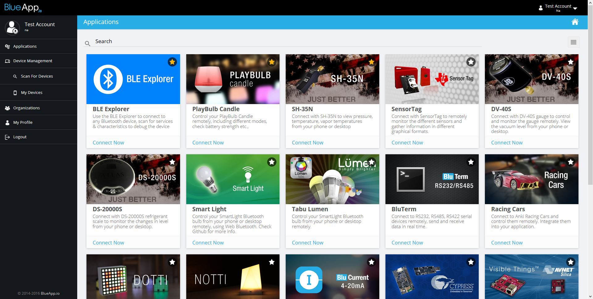

## Blueapp account setup

First thing we want to do is to open new account on [Blueapp.io](blueapp.io) page. After logging in we can check on the left side available applications, organization details and gateway informations. Basicly, one user can be member of several different organizations, and as a member one can use gateways and applications that are attached to that organizations. As an organization admin we can manage gateways, add applications or invite other users to join our organization.

After getting new account, we are able to open just our new organization, but at this point we are unable to see any of the gateways assigned to that organization. For testing purposes we can switch to some existing organization with already attached gateway with nearby bluetooth devices.
In order to join particular organization, we need admin's invitation. To get that please send email with invitation request to Blueapp team and you will get one in short term.

Now, with gateway available, we can test some of the applications listed in main application menu. Eventually we can add our new application to our organization and use it with our gateways.

For development and testing our new app on local machine, we need gateway's token, which tells application to which gateway it should connect for scanning for BLE devices.
Selecting My Devices tab you can check all the gateways that are connected to particular organization. We can click on particular organization to open gateway's details. On gateway's details page we can find Client Token that we need for our app.

Later on, we are passing this token to our application. From the app then we can scan and operate with nearby devices.